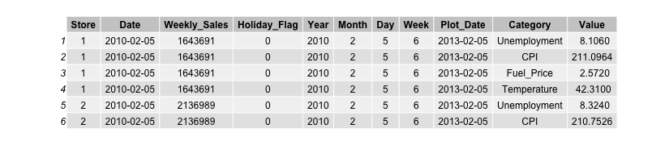

```{r setup, include=FALSE}
knitr::opts_chunk$set(echo = TRUE)
library(tidyverse)
library(patchwork)
library(stats)
library(gridExtra)
library(ggplot2)
library(magick)
```

# Importing the Dataset

I analyzed [this dataset from Kaggle](https://www.kaggle.com/datasets/yasserh/walmart-dataset) for weekly sales data from 45 Walmart stores between February 5, 2010, and November 1, 2012. In addition to weekly sales, it also includes information on if the week had a holiday (a value of 0 or 1 if Labor Day, Thanksgiving, Christmas, or the Super Bowl occurred), unemployment rate, average temperature in Fahrenheit, fuel price, and consumer price index. The dataset has 8 columns and 6435 rows (one row per store per week).

```{r, include=F}
# For turning dataframes into nicer-looking images to use in the report
# I commented out everywhere I ran it, but if you want to run it, 
# either make sure you have an images folder in the same place as this file,
# or remove the "images/" from the beginning of the file path
df_to_image = function(df, name, width_factor=75, height_factor=30) {
  file = paste0("images/", name, ".png")
  png(file, width = width_factor*ncol(df), height = height_factor*nrow(df))
  grid.table(df)
  dev.off()
}
```

```{r, echo=F}
# Original URL: https://www.kaggle.com/datasets/yasserh/walmart-dataset/data

store_data = read.csv(
  "/Users/delracman/Documents/STAT 7500/Project/Walmart.csv" # change if in different location
) %>% 
  mutate(
    Date=as.Date(Date,format="%d-%m-%Y"),
    Year=year(Date),
    Month=month(Date),
    Day=day(Date),
    Week=week(Date),
    Plot_Date=as.Date(paste(2013,Month,Day,sep="-"),format="%Y-%m-%d")
  ) %>% 
  arrange(Date)
# invisible(df_to_image(head(store_data),"store_data"))
```

```{r, include=F}
head(store_data)
```


# Total Sales Data

Below are the plots for weekly sales data over time, both over the course of the entire dataset and color-coded by year. There are highs and lows throughout the year, but generally sales are flat throughout the year, with the exception of the end of the year around the holidays, where there is a big increase in sales. There is no upward trend at the end of 2012 due to the dataset cutting off in October 2012.

```{r, echo=F}
store_data_sales = store_data %>% 
  group_by(Date) %>% 
  summarize(Total_Sales=sum(Weekly_Sales)) 

store_data_sales %>% 
  ggplot() + 
    geom_line(aes(x=Date,y=Total_Sales)) +
    labs(
      title="Total Sales Each Week",
      y="Total Sales (in millions)"
    ) +
    scale_x_date(breaks = function(x) seq.Date(from = as.Date("2010-01-01"), 
                                                 to = as.Date("2012-12-31"), 
                                                 by = "4 months")
                                              ) +
    scale_y_continuous(
      labels = scales::number_format(scale = 1/1000000), 
      limits=c(0,NA)
    )
```

As seen here, all the years are pretty similar in trends as well, with some peaks happening in slightly different spots. In order to correctly overlay the years (because going off of just the dates, even coloring by year, would just make a color-coded version of the graph above), I made a new column with the same month and day, but made the year for every week 2013. I then plotted with the new column in the x-axis, colored based on the original year, and changed the x-axis labels to exclude the year.

```{r, echo=F}
sales = store_data %>% 
  group_by(Year,Week) %>% 
  mutate(
    Average_Sales=mean(Weekly_Sales),
    Total_Sales=sum(Weekly_Sales)
  )

sales %>% 
  ggplot() + 
    geom_line(aes(x=Plot_Date,y=Total_Sales,color=factor(Year))) + 
    labs(
        x="Month-Day",
        y="Total Weekly Sales (in millions)",
        title="Total Weekly Sales Per Year Across All Stores",
        color="Year"
      ) +
    scale_x_date(
      breaks = function(x) seq.Date(from = as.Date("2013-01-01"), 
                                                 to = as.Date("2014-01-01"), 
                                                 by = "1 month"),
      date_labels="%m-%d"
    ) +
    scale_y_continuous(
      labels = scales::number_format(scale = 1/1000000), 
      limits=c(0,NA)
    )
```

## Comparing stores

I also looked at comparing each store and seeing what each store looked like in terms of sales. As you can see, all the stores follow similar trends, and each store has a similar ranking in terms of sales throughout the entire dataset. Stores 20 and 4 have the highest sales, while 33 and 44 have the lowest.

```{r, echo=F}
store_data %>% 
  ggplot() + 
    geom_line(aes(x=Date,y=Weekly_Sales, color=factor(Store))) +
    labs(
      title="Total Sales Each Week",
      y="Total Sales (in millions)"
    ) +
    scale_x_date(breaks = function(x) seq.Date(from = as.Date("2010-01-01"), 
                                                 to = as.Date("2012-12-31"), 
                                                 by = "4 months")
                                              ) +
    scale_y_continuous(
      labels = scales::number_format(scale = 1/1000000), 
      limits=c(0,NA)
    ) +
    theme(legend.position = "none")
```

```{r, echo=F}
store_data_totals = store_data %>% 
  group_by(Store) %>% 
  summarize(Total_Store_Sales=sum(Weekly_Sales)) %>% 
  arrange(desc(Total_Store_Sales))
# invisible(df_to_image(store_data_totals,"store_data_totals",width_factor=100,height_factor=22))
```

```{r, include=F}
store_data_totals
```

<!--  -->

```{r, message=F, echo=F}
store_data %>% 
  group_by(Store, Year) %>% 
  summarize(Total_Store_Sales=sum(Weekly_Sales)) %>% 
  arrange(desc(Total_Store_Sales)) %>% 
  ggplot() + 
    geom_bar(
      aes(x=factor(Store), y=Total_Store_Sales, fill=factor(Year)), 
      stat = "identity"
    ) +
    scale_x_discrete(breaks=seq(1,45,by=3)) +
    scale_y_continuous(
      labels = scales::number_format(scale = 1/1000000), 
      limits=c(0,NA)
    ) + 
    labs(
      title="Total Sales For Each Store By Year", 
      x="Store", 
      y="Total Sales (in millions)",
      fill="Year"
    )
```

## Seasons

I also decided to look at sales by season to see if there was a difference. I decided to group seasons by the following: - Winter: December, January, February - Spring: March, April, May - Summer: June, July, August - Fall: September, October, November

When looking at the plot originally for sales totals, it appeared that summer was highest and winter was lowest, which seems strange as winter should include most of the holiday shopping (though Black Friday would be considered fall). However, since the dataset is missing January 2010 and November-December 2012, it is missing a decent amount (2 months) of winter data. I then decided to look at average sales instead, where winter was the highest, lining up more with what we'd expect from the time series plots.

```{r, message=F, echo=F}
season_data = store_data %>% 
  mutate(
    Season=case_when(
      Month %in% c(12,1,2) ~ "Winter",
      Month %in% c(3:5) ~ "Spring",
      Month %in% c(6:8) ~ "Summer",
      .default = "Fall"
    )
  ) %>% 
  group_by(Season, Year) %>% 
  summarize(Total = sum(Weekly_Sales), Average=mean(Weekly_Sales)) 

season_plots = list()

season_plots[["total"]] = season_data %>% 
  ggplot() + 
    geom_bar(aes(x=Season, y=Total, fill=factor(Year)), stat = "identity") +
    labs(title="Total Sales by Season", y="Total Sales (in millions)", fill="Year") +
    scale_y_continuous(
      labels = scales::number_format(scale = 1/1000000), 
      limits=c(0,NA)
    )
season_plots[["average"]] = season_data %>% 
  ggplot() + 
    geom_bar(aes(x=Season, y=Average, fill=factor(Year)), stat = "identity") +
    labs(title="Average Sales by Season", y="Average Sales (in millions)", fill="Year") +
    scale_y_continuous(
      labels = scales::number_format(scale = 1/1000000), 
      limits=c(0,NA)
    )

season_plots[["total"]] + season_plots[["average"]] + plot_layout(ncol = 1, nrow = 2)
```

# Holidays

## Adding additional holidays

I wondered if other holidays had an impact on sales, so I decided to add other holidays to the dataset that tend to have some shopping associated with them. I marked the holidays I added with 2 (changing my logical variable into more of an ordinal one) so I could more easily differentiate the holidays I added versus the ones that already existed in the dataset.

```{r}
# Add other holidays to the store_data. 
# Flag with "2" to differentiate from pre-existing holidays in the store_dataset
# Observation: dates are for end of week, not beginning of week 
# (so take date and check week previous, not week after)
holidays = c(
  "2010-05-09", "2011-05-08", "2012-05-13", # Mother's Day
  "2012-06-20", "2012-06-19", "2012-06-17", # Father's Day
  "2010-05-31", "2011-05-30", "2012-05-28", # Memorial Day
  "2010-04-04", "2011-04-24", "2012-04-08", # Easter
  "2010-10-31", "2011-10-31", "2012-10-31", # Halloween
  "2010-07-04", "2011-07-04", "2012-07-04", # 4th of July
  "2010-02-14", "2011-02-14", "2012-02-14"  # Valentine's Day
)
determine_holiday = function(day) {
  for (holiday in holidays) {
    if(between(as.numeric(as.Date(holiday,format="%Y-%m-%d")-day), -6, 0)) {
      return(TRUE)
    }
  }
  return(FALSE)
}

# Allows determine_holiday to take in one date at a time in the ifelse
determine_holiday_vectorized <- Vectorize(determine_holiday)
store_data_with_holidays = store_data %>%
  mutate(
    Holiday_Flag = ifelse(
      Holiday_Flag==0, 
      ifelse(
        determine_holiday_vectorized(Date),
        2,
        Holiday_Flag
      ),
      Holiday_Flag
    )
  )
```

## Looking at holiday impact

I decided to remake some of the time series plots I made earlier, but point out holidays as well. One of the issues I came across is due to the the dates in the dataset being for the last day of the sale week. The way ggplot colors the graphs (as an example):

-   Dec 20 has a holiday flag of 0, as Dec 14-20 have no holidays

-   Dec 27 has a holiday flag of 1, since Christmas is 2 days earlier and contained in the week

    -   ggplot colors with a different color going forward

-   Jan 3 has a holiday flag again of 0 since there's no holiday in the previous week, so *then* ggplot changes the color back

However, we want it to color previous to the date based on the holiday flag, not previous to it. Therefore, I had to add a lead variable to get the next week's holiday flag and color off of that instead (code for lead variable below).

```{r}
holidays = store_data_with_holidays %>% 
  select(Date, Holiday_Flag) %>% 
  distinct() %>% 
  mutate(
    Next_Week_Holiday = lead(
      Holiday_Flag, default = 0
    )
  )

```

I made a plot that color-coded weeks based on their holiday flag and a plot grouped by year with points for where each holiday occurs. Based on this, it appears that most peaks in sales occur either the week of the holiday or the week before (depending on when in the week the holiday occurred. For example, a holiday occuring on a Thursday would show sales increase the same week, whereas a holiday on a Sunday would likely show the week before). What is interesting is that there appear to be small peaks at the beginning of August and beginning of October that don't correspond with holidays.

```{r, echo=F}
store_data_with_holidays = store_data_with_holidays %>% 
  group_by(Date) %>% 
  mutate(
    Total_Sales=sum(Weekly_Sales),
  ) %>% 
  left_join(
    holidays %>% 
      select(-Holiday_Flag), 
    by="Date"
  ) 

store_data_with_holidays %>% 
  ggplot() + 
    geom_line(
      aes(
        x=Date,
        y=Total_Sales, 
        color=factor(Next_Week_Holiday), 
        group=1
      )
    ) +
    labs(
      title="Total Sales Each Week", 
      color="Holiday", 
      y="Total Sales (in millions)"
    ) +
    scale_x_date(breaks = function(x) seq.Date(from = as.Date("2010-01-01"), 
                                                 to = as.Date("2012-12-31"), 
                                                 by = "6 months")) +
    scale_y_continuous(
      labels = scales::number_format(scale = 1/1000000), 
      limits=c(0,NA)
    )
```

```{r, echo=F}
store_data_with_holidays %>% 
  ggplot() + 
    geom_line(aes(x=Plot_Date,y=Total_Sales,color=factor(Year))) + 
    geom_point(aes(
      x=Plot_Date,
      y=Total_Sales,
      alpha=factor(Holiday_Flag),
      color=factor(Holiday_Flag)
    ),size=0.75, show.legend = FALSE) +
    scale_alpha_manual(values = c("0" = 0, "1" = 1, "2" = 1)) +
    scale_color_manual(values = c(
      "2010" = "#F8766D", 
      "2011" = "#00BA38", 
      "2012" = "#619CFF", 
      "1"="purple",
      "2"="magenta"
    )) +
    labs(
        x="Month-Day",
        y="Total Weekly Sales (in millions)",
        title="Total Weekly Sales Per Year Across All Stores With Holidays",
        color="Year and Holiday Flag"
      ) +
    scale_x_date(
      breaks = function(x) seq.Date(from = as.Date("2013-01-01"), 
                                                 to = as.Date("2014-01-01"), 
                                                 by = "1 month"),
      date_labels="%m-%d"
    ) +
    scale_y_continuous(
      labels = scales::number_format(scale = 1/1000000), 
      limits=c(0,NA)
    )
```

# Looking at other factors

I was interested in seeing if the other variables in the dataset affected sales in any way. So I could display the plots using a facet-wrap, I did a pivot longer to have each of the variables as a column I could group on.

```{r, echo=F}
longer_store_data = store_data %>% 
  pivot_longer(
    cols=c("Unemployment", "CPI", "Fuel_Price", "Temperature"),
    names_to="Category",
    values_to="Value"
  )
# invisible(df_to_image(head(longer_store_data),"longer_store_data"))
```

```{r, include=F}
head(longer_store_data)
```



As can be seen in the plots, there does not appear to be much relationship between CPI/unemployment/temperature/fuel price and weekly sales. Some things I noticed: - Stores don't change much in terms of CPI - No matter the fuel price, weekly sales for each store remained consistent/flat - Temperature, CPI, and Unemployment appear to have a slight right skew, but there is generally not much relationship.

```{r, echo=F}
longer_store_data %>% 
  ggplot() + 
    geom_point(aes(x=Value,y=Weekly_Sales,color=factor(Store)), size=0.75) +
    facet_wrap(~Category, scales="free") +
    theme(legend.position = "none") +
    scale_y_continuous(
      labels = scales::number_format(scale = 1/1000000), 
      limits=c(0,NA)
    ) +
    labs(y = "Weekly Sales (in millions)")
```

I also decided to divide each variable into 3 bins and create boxplots to see if there was a major difference in the median sales. While the range sizes of the middle 50% and extreme values at times differ, the medians appear to not shift across variable values.

```{r, echo=F}
store_data %>% 
  mutate(
    Unemployment = case_when(
      Unemployment <= 6~"<= 6%",
      Unemployment <= 10~"<= 10%",
      .default="> 10%"
    ),
    CPI = case_when(
      CPI <= 150 ~"<= 150",
      CPI <= 200 ~"<= 200",
      .default="> 200"
    ),
    Fuel_Price = case_when(
      Fuel_Price <= 3 ~"<= $3",
      Fuel_Price <= 4 ~"<= $4",
      .default="> $4"
    ),
    Temperature = case_when(
      Temperature <= 40 ~"<= 40 F",
      Temperature <= 75 ~"<= 75 F",
      .default="> 75 F"
    )
  ) %>% 
  select(Date, Weekly_Sales, Unemployment, CPI, Fuel_Price, Temperature) %>% 
  pivot_longer(
    cols = c("Unemployment", "CPI", "Fuel_Price", "Temperature"),
    names_to = "Category",
    values_to = "Value"
  ) %>% 
  mutate(
    SortValue = case_when(
      Value=="<= 6%"~6,
      Value=="<= 10%"~10,
      Value=="> 10%"~11,
      Value=="<= 150"~150,
      Value=="<= 200"~200,
      Value=="> 200"~201,
      Value=="<= $3"~3,
      Value=="<= $4"~4,
      Value=="> $4"~5,
      Value=="<= 40 F"~40,
      Value=="<= 75 F"~75,
      Value=="> 75 F"~76,
      .default=0
    ),
    Value=factor(Value, )
  ) %>% 
  ggplot() + 
    geom_boxplot(aes(x=reorder(Value,SortValue,mean),y=Weekly_Sales),outlier.size=0.75) + 
    facet_wrap(~Category, scales = "free", nrow = 2, ncol = 2) +
    scale_y_continuous(
      labels = scales::number_format(scale = 1/1000000), 
      limits=c(0,NA)
    ) +
    labs(y = "Weekly Sales (in millions)", x = "Value")
```

I then decided to bin the values by rounding them and creating a histogram for each variable. When looking at the histograms, Unemployment appears to have the most relationship (a downward trend), while Temperature, Fuel Price, and CPI appear to have a bell-curve shape (larger middle, lower ends). This also matches up with the calculated correlation values. Unemployment has the highest correlation but is still very low (-0.1, very close to 0).

```{r, message=F, echo=F, warning=FALSE}
rounded_data = store_data %>% 
  mutate(
    RoundedTemp=round(Temperature,digits=-1),
    RoundedCPI=round(CPI,digits=-1),
    RoundedFuel=round(Fuel_Price,digits=1),
    RoundedUnemployment=round(Unemployment)
  )

plots = list()
for (col in c("RoundedTemp", "RoundedCPI", "RoundedFuel", "RoundedUnemployment")) {
  plot = rounded_data %>%
    group_by(!!sym(col)) %>% 
    summarize(AvgSales=mean(Weekly_Sales)) %>% 
    ggplot(aes_string(x=col,y="AvgSales")) + 
      geom_bar(stat = "identity") +
      scale_y_continuous(
        labels = scales::number_format(scale = 1/1000000), 
        limits=c(0,NA)
      ) +
      labs(y="Average Sales (in millions)")
  plots[[col]] <- plot
}

plots[["RoundedTemp"]] + 
  plots[["RoundedCPI"]] + 
  plots[["RoundedFuel"]] + 
  plots[["RoundedUnemployment"]] + 
  plot_layout(ncol = 2, nrow = 2)
```

```{r, echo=F}
print(paste0("Temperature: ", cor(store_data$Temperature,store_data$Weekly_Sales,)))
print(paste0("CPI: ", cor(store_data$CPI,store_data$Weekly_Sales)))
print(paste0("Unemployment: ", cor(store_data$Unemployment,store_data$Weekly_Sales)))
print(paste0("Fuel: ", cor(store_data$Fuel_Price,store_data$Weekly_Sales)))
```

```{r, include=F}
# Looking at individual correlation values per store to see if any particular store appears to have one variable impact sales more. For example, store 35 has an unemployment/weekly sales correlation of 0.48 (somewhat strong-- means it's positively correlated), and store 38 has a correlation value for unemployment of -0.79 (strong negative correlation)
unemployment = c()
temp = c()
fuel = c()
cpi = c()
for (store in 1:45) {
  data = store_data %>% dplyr::filter(Store==store) 
  unemployment = append(unemployment, cor(data$Unemployment,data$Weekly_Sales))
  temp = append(temp, cor(data$Temperature,data$Weekly_Sales))
  fuel = append(fuel, cor(data$Fuel_Price,data$Weekly_Sales))
  cpi = append(cpi, cor(data$CPI,data$Weekly_Sales))
}
cors = data.frame(
  Store=1:45,
  Unemployment=unemployment,
  Temperature=temp,
  Fuel_Price=fuel,
  CPI=cpi
) %>% round(2)
# invisible(df_to_image(cors, "cors", height_factor=21))
cors
```

<!--  -->

```{r, include=F}
t(as.matrix(cors %>% select(-Store))) %>% heatmap(scale="column",Colv = NA, Rowv = NA)
```

I also looked at how each variable changed for each store throughout the data. As can be seen below, all stores for temperature and fuel price have similar trends and move together throughout the data, while unemployment either stays flat or decreases depending on the store, and CPI either stays flat or increases. These trends make sense as time goes on, getting further away and recovering from the 2008 recession.

```{r, echo=F}
longer_store_data = store_data %>% 
  pivot_longer(
    cols=c("Unemployment", "CPI", "Fuel_Price", "Temperature"),
    names_to="Category",
    values_to="Value"
  )

longer_store_data %>% 
  ggplot() +
  geom_line(aes(x=Date,y=Value, color=factor(Store))) +
  facet_wrap(~Category, scales = "free", nrow = 2, ncol = 2) +
  theme(legend.position = "none") 
```

# Conclusion

Based on the plots, it appears that whether a week contains or is near a holiday had the most impact on sales. All stores follow similar trends and aren't impacted much by CPI, Temperature, Unemployment, or Fuel Price.

There were a few challenges I came across while working on the project. One issue is that the data is missing Jan 2010 and Nov-Dec 2012. This makes it difficult to, for example, find out what percentage of a year's sales a particular week makes up, as I only have 52 weeks for 2011. I originally wanted to look at this to control for some stores getting more sales consistently/being larger than others. I also had to account for dates being the last day of the sales week and not before. When I was first adding in holidays (and treated the dates as if they represented the first day of the week), I thought the holidays that were already existing in the dataset were wrong because they seemed to be a week off. I also, again, had to add the lead variable for ggplot to correctly color weeks, because the dates were for the last day and not the first. Finally, I wish I had some more information on each store, such as where stores were located, population of area, distance to other Walmarts, etc. That way, I could look at whether a store has low sales because they have a low population, or if there's just a lot of Walmarts in the area, which would spread sales out.

I started to look into temperature patterns to see if I could maybe get a sense of region, and all stores have cold winters and warmer summers, suggesting that they are all in a region that at least experiences changes in seasons rather than consistent weather year-round. Many stores are similar in terms of temperatures, but one store reaches a maximum of 60 degrees during the summer, suggesting that maybe they are in the northern part of the Northeast, while another seems to be above 50 degrees the entire year, including the winter, suggesting that they might be in the southern part of the country, or west coast where temperatures tend to be warmer compared to the east coast, However, beyond this, it's hard to tell where these stores may be.

```{r, include=F}
# Temperatures by store
store_temps_grouped = store_data %>% 
  group_by(Store, Month) %>% 
  summarize(Mean_Temperature=mean(Temperature)) %>% 
  mutate(
    Month_Name = month.name,
    Mean_Temperature = round(Mean_Temperature, 2)
  )
store_temps = store_temps_grouped %>% 
  dplyr::select(-Month) %>% 
  pivot_wider(
    names_from=Month_Name,
    values_from = Mean_Temperature
  )
# invisible(df_to_image(store_temps,"store_temps",width_factor=65,height_factor=22))
store_temps
```

<!--  -->

```{r, echo=F}
store_temps_grouped %>% 
  ggplot() + 
    geom_line(aes(x=Month,y=Mean_Temperature,color=factor(Store))) +
    theme(legend.position = "none") +
    scale_x_continuous(breaks=c(1:12))
```
